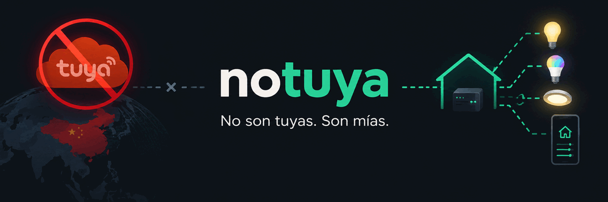

# notuya-go

A dependency-free Go reimplementation of the Tuya local protocol v3.5 — the
protocol spoken by Tuya smart bulbs on the local network, with no cloud
round-trip.

No Go or Rust library today supports protocol 3.5 (GCM + session handshake)
— every community alternative stops at 3.1-3.3 (plain AES-ECB, no session
negotiation). This project implements it from scratch, using
[`tinytuya`](https://github.com/jasonacox/tinytuya)'s own source as a
byte-for-byte reference.

## Status

A library only (`pkg/`), used in-process by [notuya-gui](https://github.com/alex-bluetrain/notuya-gui). There is no
binary in this module.

## Scope

- Tuya local protocol **v3.5 only** for now, in four layers (transport →
  session → `dp` → `bulb`/`discovery`) so another version is a new
  transport/session pair with nothing above it changed.
- `pkg/bulb`: on/off, colour, white, scenes, timer, do-not-disturb, status
  pushes (`Watch`), and `StreamColours` for live colour streaming over one
  persistent session. `pkg/dp`: every documented DP, encoded and validated.
  `pkg/discovery`: LAN scan for `device_id` + IP.
- No external dependencies — only the Go stdlib. No cgo.

## Development

```bash
make check   # go vet + go test
```
